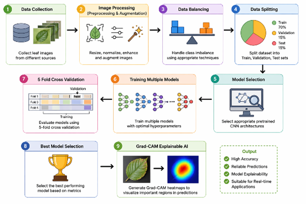

# EfficientNetB0: A Comparative Study of Modern Robust CNN Architectures for Bean Leaf Disease Detection with Grad-CAM Visualization

## 📌 Project Overview

This project presents an unpublished research study on automated bean leaf disease detection using deep learning. The study evaluates the performance of modern Convolutional Neural Network (CNN) architectures, with **EfficientNetB0** demonstrating strong classification performance.

To improve model interpretability, **Grad-CAM (Gradient-weighted Class Activation Mapping)** is used to visualize the regions of leaf images that most influenced the model's predictions.

---

## 🎯 Objectives

- Detect bean leaf diseases using deep learning.
- Compare the performance of modern CNN architectures.
- Evaluate classification accuracy using standard metrics.
- Improve model explainability with Grad-CAM visualization.

---

## 🛠 Technologies Used

- Python
- TensorFlow / Keras
- EfficientNetB0
- OpenCV
- NumPy
- Matplotlib
- Grad-CAM

---

## 📂 Repository Contents

| File | Description |
|------|-------------|
| 📄 Report.pdf | Complete research paper |
| 💻 Source Code | Model training, evaluation and Grad-CAM implementation |

---

## 🧠 Model

Several models, such as- InceptionV3, ResNet101, DenseNet121, ShuffleNetV2 and EfficientNetB0 are  used in this study where **EfficientNetB0**, a lightweight and efficient convolutional neural network architecture provides high accuracy while maintaining computational efficiency.

---

## 🔍 Explainable AI

This project uses **Grad-CAM (Gradient-weighted Class Activation Mapping)** to visualize the image regions responsible for model predictions, making the deep learning model more interpretable.

---

## 📊 Features

- Bean leaf disease classification
- CNN model comparison
- EfficientNetB0 implementation
- Grad-CAM visualization
- Research report
- Python source code

---

## 📚 Course Information

**Course Code:** CSE366

**Course Title:** Artificial Intelligence

---

## 📄 Publication Status

This work was completed as an academic course project and has **not been formally published**.

---

## 👩‍💻 Author

**Samiha Hasan**

Department of Computer Science and Engineering

---

## 📜 License

This project is shared for educational and research purposes.
